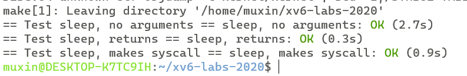
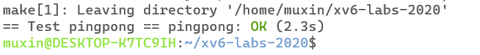
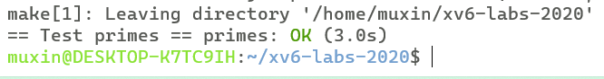
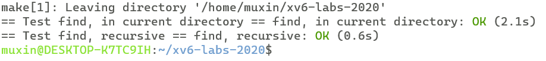
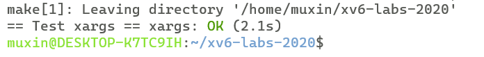

# xv6 labs
## **lab1**:Xv6 and Unix utilities
### **Exercise1** Boot xv6
任务：
git获得源码
make qemu 构建和运行Xv6
### **Exercise2** sleep
任务：

实现一个Unix程序sleep，功能是暂停指定数目的ticks（内核定义的时间概念），程序接受一个参数，为指定的ticks数目

代码：

```c
#include "kernel/type.h"
#include "kernel/stat.h"
#include "user/user.h"

int main(int argc, char *argv[]){
    if(argc != 2){
        fprintf(2,"The argument number is invaild\n");
        exit(1);
    }
    int ticks = atoi(argv[1]);
    sleep(ticks);
    exit(0);
}
```
grade结果：



### **Exercise3** pingpong
任务：

实现一个Unix程序pingpong，通过一对管道在两个进程之间互相传输一个字节

代码：

```c
#include "kernel/types.h"
#include "kernel/stat.h"
#include "user/user.h"
int main(int argc, char *argv[]){
    int p1[2],p2[2];
    pipe(p1);   //parent to child
    pipe(p2);   //child to parent
    
    if(fork() != 0){    //parent
        char buf;
        write(p1[1],"a",1);
        read(p2[0],&buf,1);
        printf("%d: received pong\n",getpid());
        wait(0);
    }
    else{               //child
        char buf;
        read(p1[0],&buf,1);
        printf("%d: received ping\n",getpid());
        write(p2[1],&buf,1);
    }
    exit(0);
}
```

grade 结果：



### **Exercise4** primes
任务：

通过管道和多个进程来实现一个质数筛，筛出2~35之间的质数

原理如下图：


代码：

```c
#include "kernel/types.h"
#include "kernel/stat.h"
#include "user/user.h"

void fun(int *pl){
    int num;
    read(pl[0],&num,sizeof(num));
    if(num == -1){
        exit(0);
    }
    printf("prime %d\n",num);
    int pr[2];
    pipe(pr);
    if(fork()!=0){  //parent
        int temp;
        while (read(pl[0],&temp,sizeof(temp)))
        {
            if(temp%num!=0){
                write(pr[1],&temp,sizeof(temp));
            }   
        }
        close(pl[0]);
        close(pr[1]);
        wait(0);
    }
    else{       //child
        close(pr[1]);
        fun(pr);
    }
}
int main(int argc,char *argv[]){
    if(argc!=1){
        fprintf(2,"argument number invaild!\n");
        exit(1);
    }
    int p1[2];
    pipe(p1);
    if(fork()!=0){  //parent
        int nums[35-2+2];
        for(int i=2;i<=35;++i){
            nums[i-2] = i;
        }
        nums[35-2+1] = -1;
        write(p1[1],(char*)nums,sizeof(nums));
        close(p1[0]);
        close(p1[1]);
        wait(0);
    }
    else{   //child
        close(p1[1]);
        fun(p1);
    }
    exit(0);
}
```

note:

**在数组nums最后加了哨兵-1，让处理变得简单很多**

grade 结果：



### **Exercise5** find
任务：

实现Unix程序find，功能是查找目录树中具有特定名称的所有文件

代码：

```c
#include "kernel/types.h"
#include "user/user.h"
#include "kernel/fs.h"
#include "kernel/stat.h"

char path[512] = {0} , *p;
char*
fmtname(char *path)
{
  static char buf[DIRSIZ+1];
  char *p;

  // Find first character after last slash.
  for(p=path+strlen(path); p >= path && *p != '/'; p--)
    ;
  p++;

  // Return blank-padded name.
  if(strlen(p) >= DIRSIZ)
    return p;
  memmove(buf, p, strlen(p));
  memset(buf+strlen(p), 0 , DIRSIZ-strlen(p));
  return buf;
}
void find(char *path,char *file){
    int fd;
    struct dirent de;
    struct stat st;
    if((fd = open(path, 0)) < 0){
        fprintf(2, "find: cannot open %s\n", path);
        return;
    }
    if(fstat(fd, &st) < 0){
        fprintf(2, "find: cannot stat %s\n", path);
        close(fd);
        return;
    }
    switch (st.type)
    {
    case T_FILE:
        if(strcmp(fmtname(path),file) ==0 ){
            printf("%s\n",path);
        }
        break;
    
    case T_DIR:
        if(strlen(path) + 1 + DIRSIZ + 1 > 512){
            printf("ls: path too long\n");
            break;
        }
        *p = '/';
        p++;
        while(read(fd, &de, sizeof(de)) == sizeof(de)){
            if(de.inum == 0)
                continue;
            if(strcmp(de.name,".") == 0 || strcmp(de.name,"..") == 0){
                continue;
            }
            memmove(p, de.name, DIRSIZ);
            int shift = 0;
            while (p[shift] != 0)
            {
                shift++;
            }
            p += shift;
            find(path,file);
            p -= shift;
            memset(p,0,DIRSIZ);

        }
        p--;
        *p = 0;
        break;
    }
    close(fd);
}

int main(int argc, char *argv[]){
    if(argc != 3){
        fprintf(2,"The argument number is invaild\n");
        exit(1);
    }
    strcpy(path,argv[1]);
    p = path+strlen(argv[1]);
    *p = 0;
    find(path,argv[2]);
    exit(0);
}
```

note:

**使用了ls中定义的函数fmtname来找到path中的文件名，c字符串使用时要谨慎**

grade 结果：



### **Exercise6** xargs
任务：

实现一个简化版的xargs程序，从标准输入读取行并为每一行运行一个命令，将该行作为参数提供给命令。假设每个命令只有一个额外参数

代码：

```c
#include "kernel/types.h"
#include "user/user.h"
#include "kernel/stat.h"
#include "kernel/param.h"

int main(int argc, char *argv[]){
    char buf[512] = {0};
    char *argbuf[5];
    char *p = buf;
    for(int i=1;i<argc;++i){
        argbuf[i-1] = argv[i];
    }
    argbuf[argc-1] = buf;
    while(read(0,p,1)==1){
        if(*p == '\n'){
            *p-- = 0;
            if(fork() == 0){
                //exec(argv[1],argv+2);
                exec(argbuf[0],argbuf);
                exit(0);
            }
            else{
                memset(buf,0,p-buf);
                p = buf;
            }
        }
        else{
            p++;
        }
    }
    while(wait(0)!=-1){}
    exit(0);
}
```

note:

**需要注意的是，main函数在传入参数时，argv[argc] = 0，即为空指针。因此，与之对应，在调用exec时，需要保证传入的argv也满足，argv[argc] = 0**


grade 结果：

