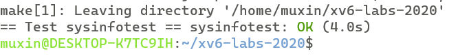

# xv6 labs
## **lab2**:system calls
### **Exercise1** System call tracing
任务：

实现一个系统调用trace，trace系统调用接受一个int参数mask，mask对应位置位则对应的系统调用在调用时要打印一行信息，包括pid，系统调用的名称和返回值。trace应该跟踪调用它的进程和它的所有子进程

代码：

首先需要在 /kernel/proc.h 中的proc结构体中添加trace_mask变量
```c
struct proc {
   struct file *ofile[NOFILE];  // Open files
   struct inode *cwd;           // Current directory
   char name[16];               // Process name (debugging)
+  int trace_mask;              // Trace mask
 };
```
之后修改 /kernel/proc.c 中的fork函数，使得fork时，子进程复制父进程的trace_mask

```c
int
fork(void)
   }
   np->sz = p->sz;

+  np->trace_mask = p->trace_mask;   //copy the trace_mask to child process
+
   np->parent = p;
```

在/kernel/syscall.h 中定义trace对应的系统调用编号

```c
 #define SYS_link   19
 #define SYS_mkdir  20
 #define SYS_close  21
+#define SYS_trace  22
+#define SYS_num    23
```

在/kernel/sysproc.c中定义sys_trace函数，是真正实现trace系统调用的函数，将trace的参数赋给当前进程的trace_mask变量

```c
+uint64
+sys_trace(void){
+  int n;
+  if(argint(0,&n)<0){
+    return -1;
+  }
+  myproc()->trace_mask = n;
+  return 0;
+}
```

之后在 /kernel/syscall.c 中声明sys_trace函数，并在syscalls函数指针数组中添加sys_trace，并创建syscall_names字符串数组，记录不同系统调用编号对应的名称，同时修改syscall函数，使得调用完系统调用后打印trace信息

```c
 extern uint64 sys_uptime(void);
+extern uint64 sys_trace(void);
```
```c
 static uint64 (*syscalls[])(void) = {
 [SYS_link]    sys_link,
 [SYS_mkdir]   sys_mkdir,
 [SYS_close]   sys_close,
+[SYS_trace]   sys_trace,
 };
```

```c
+ static char* syscall_names[SYS_num] = {" ","fork","exit","wait","pipe","read","kill","exec","fstat","chdir","dup","getpid","sbrk","sleep","uptime","open","write","mknod","unlink","link","mkdir","close","trace"};
```

```c
void
syscall(void){
   num = p->trapframe->a7;
   if(num > 0 && num < NELEM(syscalls) && syscalls[num]) {
     p->trapframe->a0 = syscalls[num]();
+    int trace_mask = p->trace_mask;
+    if((1<<num) & trace_mask){
+      printf("%d: syscall %s -> %d\n",p->pid,syscall_names[num],p->trapframe->a0);
+    }
   } 
```

之后在/user/user.h中声明trace()函数，给用户空间添加系统调用接口

```c
 char* sbrk(int);
 int sleep(int);
 int uptime(void);
+int trace(int);
```

同时需要在/user/usys.pl脚本文件中添加trace，它生成实际的系统调用stub

```pl
 entry("sbrk");
 entry("sleep");
 entry("uptime");
+entry("trace");
```

grade 结果：


### **Exercise2** System call sysinfo
任务：

实现系统调用sysinfo，sysinfo接受一个指向struct sysinfo 的指针，统计空闲内存和当前进程数，并写入sysinfo中

代码：

增加系统调用的方法不再赘述

在/kernel/sysproc.c中实现sys_sysinfo函数

```c
+
+uint64
+sys_sysinfo(void){
+  uint64 p;
+  if(argaddr(0,&p)<0){
+    return -1;
+  }
+  struct sysinfo sif;
+  sif.freemem = free_space_amout();
+  sif.nproc = pro_num();
+  if(copyout(myproc()->pagetable,p,(char*)&sif,sizeof(sif))<0){
+    return -1;
+  }
+  return 0;
 }
```

其中调用了free_space_amout函数统计了空闲内存，调用了pro_num函数统计了当前进程数，并且调用copyout函数将sysinfo拷贝到了用户空间中

free_space_amout实现在/kernel/kalloc.c文件中

```c
+uint64 free_space_amout(){
+  uint64 ret = 0;
+  acquire(&kmem.lock);
+  struct run *r = kmem.freelist;
+  while(r){
+    ret += PGSIZE;
+    r = r->next;
+  }
+  release(&kmem.lock);
+  return ret;
+}
```

原理是遍历了空闲内存链表，统计空闲内存字节数

pro_num函数实现在/kernel/proc.c文件中

```c
+uint64
+pro_num(){
+  struct proc *p;
+  uint64 ret = 0;
+  for(p = proc; p<&proc[NPROC];p++){
+    if(p->state != UNUSED){
+      ret++;
+    }
+  }
+  return ret;
+}
+
```
原理是遍历了proc数组，统计了所有状态不为UNUSED状态的进程

同时，需要在/kernel/defs.h中声明free_space_amout函数和pro_num函数

```c
 // kalloc.c
+uint64          free_space_amout();
 void*           kalloc(void);
 void            kfree(void *);
 void            kinit(void);

 // proc.c
+uint64          pro_num();
 int             cpuid(void);
 void            exit(int);
 int             fork(void);
```

grade 结果:

